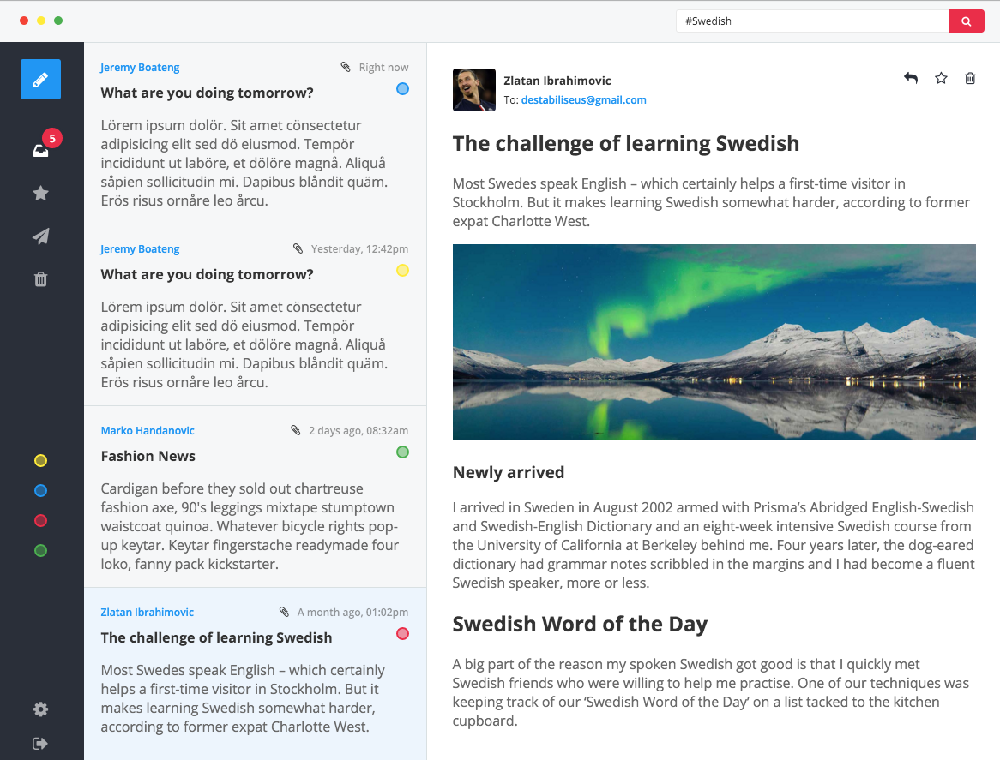

## Inbox Template
I saw an elegant inbox template from [codepen](http://codepen.io/romamilkovic/full/PPyvXa/) and restructured it with **React**, **Redux**, **CSS Modules** and **PostCSS** and planed to make it more dynamic and interactive.

